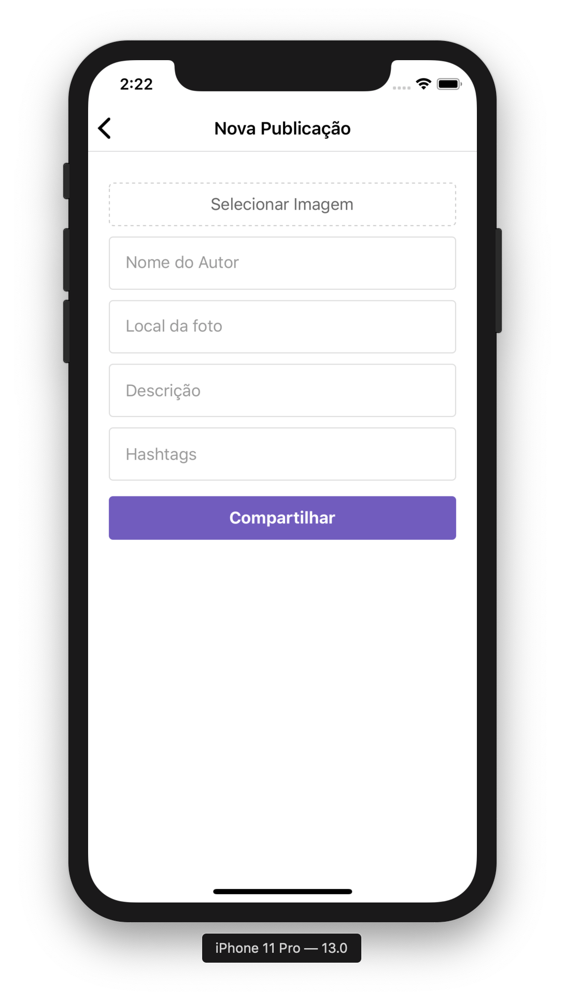
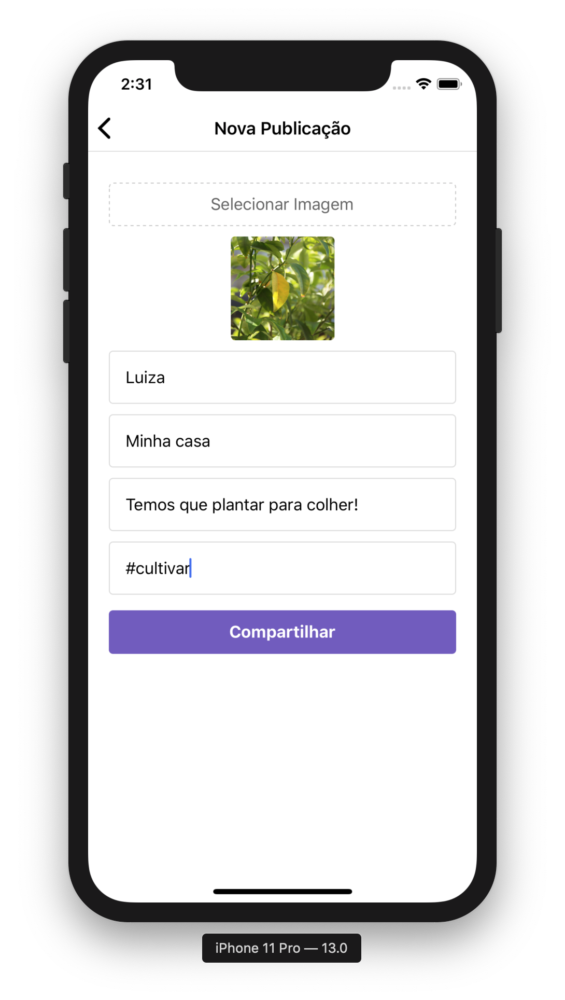
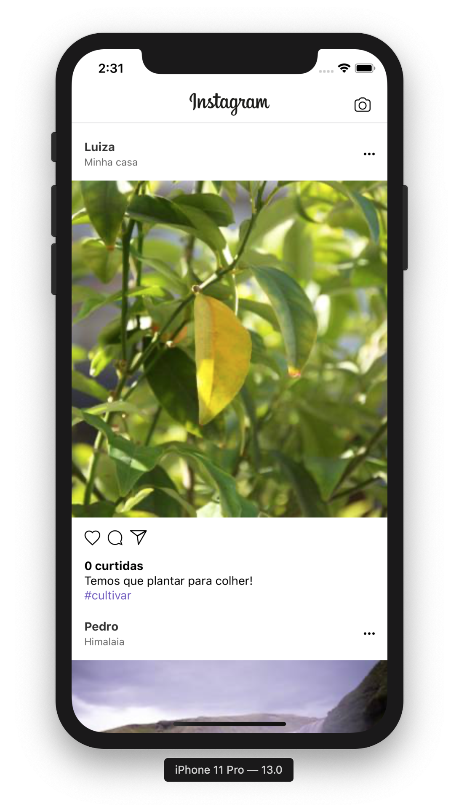
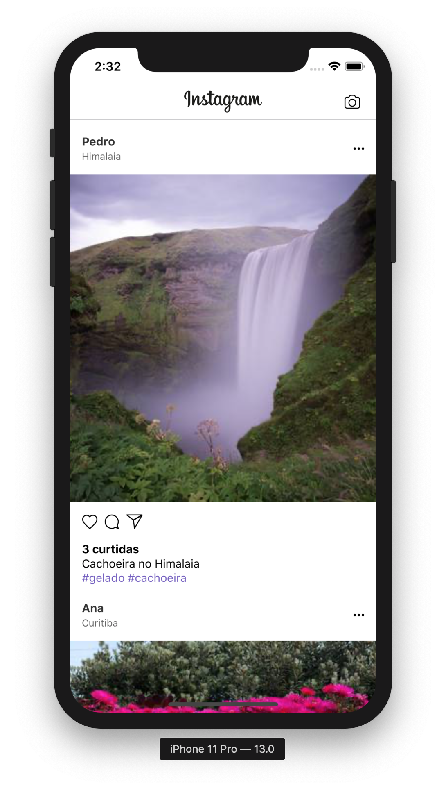

# instaclone
App made with React Native for practice.

Main libs used: axios, native image picker, react navigation and socket.io.

The application connects to a backend (https://github.com/juanvl/instanode) that saves all data in MongoDB Atlas.

Also there is a web version of this project: https://github.com/juanvl/instawebclone

 
<b>Screenshots:</b>

  
  
  
  

